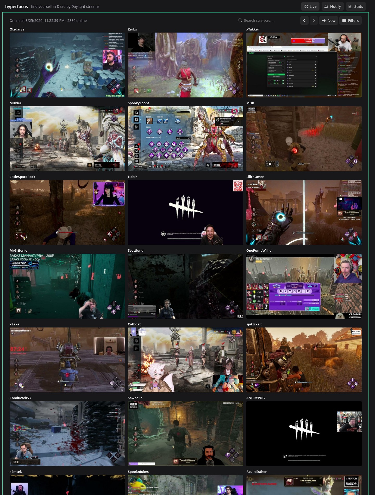

<p align="center">
  
</p>

<h3 align="center"><a href="https://hyperfocusdbd.com">🔗 hyperfocusdbd.com</a></h3>

# Hyperfocus

Find out when you're playing against a streamer in *Dead by Daylight* — usually while the match is still going.

Hyperfocus watches every live Dead by Daylight stream on Twitch, OCR-reads the survivor names off each stream's preview, and pings you in your own Twitch chat whenever your Steam name shows up in another streamer's lobby. It's also a searchable archive of the whole category: who was live at any moment, with thumbnails, viewer counts, titles and survivor names.

> **Only Dead by Daylight is supported** — the name reader is built specifically for the DBD HUD.

## Features

- **Streamer detection notifications** — optional Twitch chat bot: matches your Steam name against the survivors in other streamers' lobbies and pings you on a hit (see [Notifications](#notifications))
- **Live polling** — continuously fetches every DBD stream from Twitch (~2800 per cycle) in a back-to-back poll loop
- **Historical snapshots** — step back in time with prev/next buttons, a datetime picker, or the "Now" button that glows when newer data arrives (3-hour rolling window on the live site)
- **Thumbnail gallery** — responsive grid of 16:9 previews with survivor-match score badges and infinite scroll
- **OCR survivor names** — reads the 4 player names from the bottom-left HUD of each 1080p preview (720p fallback) via [hyperfocus2-ocr](https://github.com/rofleksey/hyperfocus2-ocr) (PaddleOCR PP-OCRv3 on ONNX Runtime)
- **Fuzzy survivor search** — loose matcher that tolerates OCR recognition errors, ranked by match score; plus a streamer-name filter
- **Streamer detail** — click any card to see that moment's sample: full preview, viewer count, title, tags, and the OCR'd survivor names
- **Stats charts** — streams online, total viewers, cycle time, disk usage, preview capture rate, OCR success rate, and subscription growth over time
- **SEO-ready** — per-route titles and descriptions, Open Graph + Twitter cards, sitemap, robots.txt, JSON-LD structured data, original skill-check favicon
- **No accounts, no cookies** — Vue 3 + PrimeVue SPA, dark theme, fully responsive

## The site

| Page | What it is |
|------|------------|
| `/` | Landing page — what the service does, how notifications work, FAQ |
| `/live` | The gallery — current and historical snapshots, search and filters |
| `/stream/:id` | Streamer detail for a specific moment |
| `/stats` | Charts of the poller's health over time |
| `/subscribe` | Sign up for lobby-detection notifications |

## Notifications

1. **Subscribe** — enter your Twitch username and Steam profile URL on `/subscribe`.
2. **Verify** — the bot joins your chat; type `!hyperfocussub` in *your own* channel to confirm it's you.
3. **Tracked** — every live DBD preview is OCR-read to extract the four survivor names.
4. **Detected** — when your Steam name fuzzy-matches (score ≥ `notify.min_score`, default 0.60) a survivor in another streamer's lobby, the bot pings you in your chat with their channel name.

Notifications arrive as **chat messages in your own channel** — no whispers, no DMs. Unverified subscriptions expire after 24 hours; type `!hyperfocusunsub` in your chat to unsubscribe anytime. A per-streamer cooldown (`notify.cooldown`, default 30m) suppresses repeat pings. Your Steam display name is refreshed automatically.

### Will it detect you?

Detection relies on reading names from stream previews, so it won't catch everything:

- **Anonymous mode** — your nickname is replaced with the character's name, so there's nothing to match
- **Hidden survivor names** — the streamer disabled them in their game settings
- **Obscured HUD** — names covered by overlays, unusual HUD placement, or unreadable previews
- **Very short matches** — under roughly 5 minutes can end before the tracker checks that stream
- **Tricky nicknames** — very short, very common (`cat`, `orange`, `111`), or non-Latin names may be missed or matched to the wrong player

Matching is fuzzy on purpose (so OCR mistakes don't cause misses), which means occasional false positives are possible.

## Architecture

```
Twitch Helix API          Steam API
       │                       │
       ▼                       ▼
┌────────────┐         ┌──────────────┐         ┌─────────┐
│   Poller   │────────▶│  PostgreSQL  │◀────────│  HTTP   │
│ (perpetual)│         │              │         │   API   │
└─────┬──────┘         └──────┬───────┘         └────┬────┘
      │                       │                      │
      ▼                       │                      ▼
┌────────────┐                │              ┌──────────────┐
│  OCR micro │                │              │  Vue 3 SPA   │
│  (ONNX)    │◀───────────────┘              └──────────────┘
└────────────┘
      ▲
┌─────┴───────┐
│  Notify bot │────▶ Twitch IRC
└─────────────┘
```

Each poll cycle: fetch live streams → download preview images → OCR survivor names in parallel → store a snapshot with samples in Postgres. The HTTP API serves the embedded SPA and a read-only JSON API. Background loops handle retention pruning, Steam name resolution, and IRC lobby notifications.

## Tech stack

| Layer | Technology |
|-------|-----------|
| Backend | Go 1.26, `net/http` (Go 1.22+ routing) |
| Database | PostgreSQL 18, `pgx/v5` |
| Frontend | Vue 3, TypeScript, PrimeVue 4, Chart.js, [unhead](https://unhead.dev) |
| OCR | [hyperfocus2-ocr](https://github.com/rofleksey/hyperfocus2-ocr) — Python, PaddleOCR PP-OCRv3, ONNX Runtime |
| IRC | `go-twitch-irc/v4` |
| Twitch API | `nicklaw5/helix/v2` |
| Infra | Docker Compose, GitHub Actions, Traefik |

## Run locally

```bash
cp config.example.yaml config.yaml   # edit with your Twitch API credentials
make all                             # builds the Vue SPA, then the Go binary
./bin/hyperfocus
```

The embedded SPA is served on `:8080`; migrations run automatically. Useful Make targets: `make run`, `make test` (race detector), `make lint`, `make typecheck` (vue-tsc), `make docker`.

## Config

Preview sizes are fixed: full previews are 1920×1080 with a 1280×720 fallback, gallery thumbnails 480×270. Everything else lives in YAML:

```yaml
service:
  http_addr: ":8080"

db:
  host: "localhost"
  port: 5432
  user: "postgres"
  database: "hyperfocus"

twitch:
  client_id: "..."       # from dev.twitch.tv
  client_secret: "..."

twitch_bot:              # optional bot credentials (falls back to twitch.*)
  refresh_token: "..."   # bot account token (chat:read chat:edit scope)

ocr:
  enabled: true
  api_url: "http://localhost:8081"   # hyperfocus2-ocr service

notify:
  enabled: false         # optional chat notifications
  min_score: 0.60        # fuzzy-match threshold for detection
  cooldown: "30m"        # per-streamer notification cooldown

steam:
  api_key: "..."         # Steam Web API key (notifications)

prune:
  interval: "1h"
  hours: 3               # data retention window (hyperfocusdbd.com keeps 3h)
```

All knobs and defaults: see [`config.example.yaml`](config.example.yaml). Sensitive values can also be set via `HYPERFOCUS_*` environment variables (e.g. `HYPERFOCUS_TWITCH_CLIENT_SECRET`).

## Disclaimer

Hyperfocus is an independent fan project. It is not affiliated with, endorsed by, or sponsored by Twitch Interactive, Valve Corporation, Behaviour Interactive, or their partners. "Dead by Daylight" and related trademarks, logos, and game content belong to Behaviour Interactive; Steam and related marks belong to Valve; Twitch and related marks belong to Twitch Interactive. The project respects their rights and complies with the respective API terms.

## Related

- [hyperfocus2-ocr](https://github.com/rofleksey/hyperfocus2-ocr) — OCR microservice for survivor-name extraction
