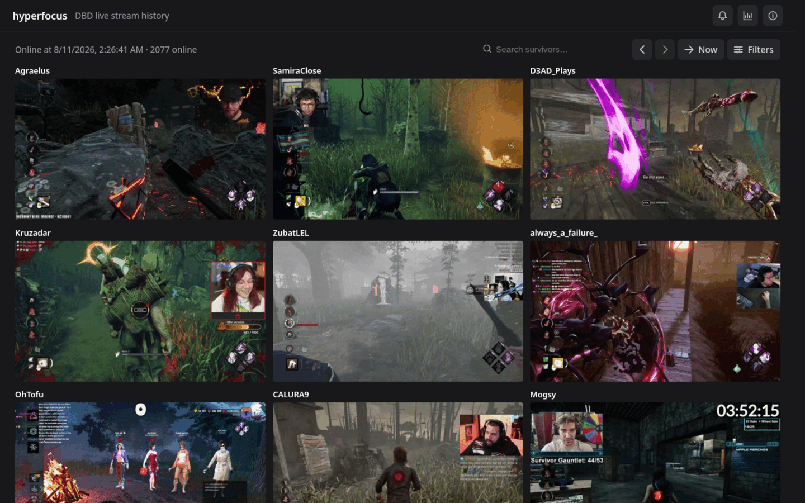

<p align="center">
  
</p>

# Hyperfocus — Dead by Daylight live stream history

Hyperfocus tracks every active [Dead by Daylight](https://store.steampowered.com/app/381210/Dead_by_Daylight/) stream on Twitch in real time. It captures periodic snapshots of viewer counts, stream titles, preview thumbnails, and player names so you can browse who was online at any moment — past or present.

## Features

- **Live polling** — continuously fetches all DBD streams from Twitch, ~2000 per snapshot
- **Historical snapshots** — every ~3 minutes; navigate back in time with prev/next buttons or a datetime picker
- **OCR survivor names** — extracts the 4 player names from the bottom-left HUD of each stream's preview using [PaddleOCR on ONNX Runtime](https://github.com/rofleksey/hyperfocus2-ocr)
- **Fuzzy search** — search by streamer name (Twitch), language, or survivor in-game name with a loose matcher that tolerates OCR recognition errors
- **Streamer history** — click any streamer to see their session history, viewer trends, and past VODs
- **Notifications** — optional Twitch chat bot that notifies streamers when a tracked player appears in their lobby
- **Dark UI** — built with Vue 3 + PrimeVue, responsive, no accounts, no cookies

## Architecture

```
Twitch Helix API
       │
       ▼
┌─────────────┐    ┌──────────────┐    ┌─────────┐
│   Poller    │───▶│  PostgreSQL  │◀───│  HTTP   │
│  (3 min)    │    │              │    │   API   │
└──────┬──────┘    └──────┬───────┘    └────┬────┘
       │                  │                 │
       ▼                  │                 ▼
┌─────────────┐           │         ┌──────────────┐
│  OCR micro  │           │         │  Vue 3 SPA   │
│  (ONNX)     │───────────┘         └──────────────┘
└─────────────┘
```

Each poll cycle: fetch live streams → download preview images → OCR survivor names → store sample + snapshot in Postgres. The HTTP API serves the SPA and a read-only JSON API. Background loops handle retention pruning and optional Steam name sync.

## Tech stack

| Layer | Technology |
|-------|-----------|
| Backend | Go 1.26, `net/http` (Go 1.22+ routing) |
| Database | PostgreSQL 18, `pgx/v5` |
| Frontend | Vue 3, TypeScript, PrimeVue 4 |
| OCR | [hyperfocus2-ocr](https://github.com/rofleksey/hyperfocus2-ocr) — Python, PaddleOCR PP-OCRv3, ONNX Runtime |
| IRC | `go-twitch-irc/v4` |
| Twitch API | `nicklaw5/helix/v2` |
| Infra | Docker Compose, GitHub Actions, Traefik |

## Run locally

```bash
cp config.example.yaml config.yaml   # edit with your Twitch API credentials
go build -o hyperfocus ./cmd/server/
./hyperfocus
```

The embedded Vue SPA is served on `:8080`. Migrations run automatically.

## Config

```yaml
service:
  http_addr: ":8080"

db:
  host: "localhost"
  port: 5432
  user: "postgres"
  database: "hyperfocus"

twitch:
  client_id: "..."       # from dev.twitch.tv
  client_secret: "..."

ocr:
  enabled: true
  api_url: "http://localhost:8081"   # hyperfocus2-ocr service

notify:
  enabled: false                     # optional chat notifications

prune:
  interval: "1h"
  hours: 6                           # data retention window
```

## Related

- [hyperfocus2-ocr](https://github.com/rofleksey/hyperfocus2-ocr) — OCR microservice for survivor name extraction
- Live at **[hyperfocusdbd.com](https://hyperfocusdbd.com)**
